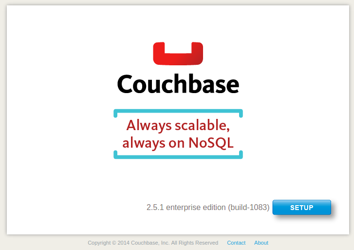

#Couchbase Docker Container
> lifegadget/docker-couchbase [[container](https://registry.hub.docker.com/u/lifegadget/docker-couchbase/)]

## Introduction

This is meant as a way to provide Couchbase Enterprise and Community servers within a Docker container. This container borrows ideas from  [ncolomer/docker-templates](https://github.com/ncolomer/docker-templates), [dockerimages/couchbase](), and [dustin/couchbase](https://gist.github.com/dustin/6605182) and was designed to work well with the other LifeGadget containers to become part of a full-stack implementation:

- NGINX Webserver - [lifegadget/docker-nginx](https://github.com/lifegadget/docker-nginx)
- PHP FPM Server - [lifegadget/docker-php](https://github.com/lifegadget/docker-php)

Feel free to use and we are happy to accept PR's if you have ideas you feel would be generally reusable.

## Usage ##

###Prerequisites

For most people the default docker installation will be fine and in fact you can just proceed with the presumption you are fine and run the the image and see if it starts. If you're watching the couchbase build process carefully you *will* see couchbase's installation throw a warning about:

> /opt/couchbase/etc/couchbase_init.d: 47: ulimit: error setting limit (Operation not permitted)

While this may seem like a potential problem it is a red herring. What it's trying to do is allocated itself proper headroom for memory and open files (as Couchbase is a big consumer of both) but programs that run under upstart are regulated by their configuration in the `/etc/config` directory and in turn containers that run under Docker inherit limits set by the docker.conf file (if you have one ... some distros don't). While it can't allocate the headroom directly itself it is likely that Docker is already asking for enough resources to share with your couchbase container. Memory, for instance, is unlimited. 

Here is what has been historically recommended for the `/etc/init/docker.conf` file (in other Dockerfile's i've seen):

	limit memlock unlimited unlimited
	limit nofile 262144

For most people the "nofile" limit is actually LESS than what docker asks for. Do not move downward from any limit set. As already stated, typically memory is NOT limited by Docker but if it is you can change it to how it is represented above (or just remove it completely). 

If you had to make any changes, you'll need to restart the docker daemon. On modern Ubuntu versions this is managed by **upstart** so you should just type `sudo service docker restart`, if you're not using upstart then try: `/etc/init.d/docker restart`. 

###Basic usage:

	sudo docker run -d \
		-p 11210:11210 -p 8091:8091 -p 8092:8092 \
		-lifegadget/docker-couchbase 	

This will get you up and running with an empty database with a single Couchbase node. Go to the host machine and point your browser to http://localhost:8091 and you'll get the familiar startup screen:

###Advanced usage:

There are two major ways of getting a more controlled startup experience with your containers:

1. Start Commands
2. Volume Sharing

Of course a third option is to install the Couchbase CLI on the host and you can manage the container through port 8091 in the basic example above. Assuming you're interested in being more Docker-suave, however, please proceed to these two controls that you get "out of the box". The best way to start is with the various "commands" being provided. 

####Start Commands
	
The basic usage example ran `lifegadget/docker-couchbase` but specified no parameters. The lack of any parameter means that the default command of "start" was used. The other commands that are available include "join", "transfer", and "load". Each is defined below:

- `start` - starts the container with couchbase running but with no configuration set other than having pointed the data directory to `/app/data`
- `transfer` - starts the container but then transfers a set of bucket's from another running Couchbase instance.
- `load` - starts the container and then runs a `cbrestore` from a Couchbase backup directory/files. 
- `join` - starts the container and then joins it to an existing 
 
## Versions ##
All versions of Couchbase use a base image of Ubuntu (currently 14.04). The 
available Couchbase versions is broken up by both "Enterprise/Community" editions, 

into both the build number and whether the build is 'community' or 'enterprise'. Currently the only available versions are Enterprise releases but in the future a branch for community will be created:

<table>
	<tr>
		<th>label</th>
		<th>vlabel</th>
		<th>Description</th>
	</tr>
	<tr>
		<td>latest</td>
		<td>3.0.beta</td>
		<td>Couchbase Enterprise - Beta Release</td>
   </tr>
	<tr>
		<td>stable</td>
		<td>2.5.1</td>
		<td>Couchbase Enterprise 2.5.1 - Production Release</td>
   </tr>
</table>

## License

**docker-couchbase** was based on, but heavily modified from, [Dockerfile](https://gist.github.com/dustin/6605182). The rewrite was done by [Ken Snyder](http://ken.net) and made available under the under the [MIT license](https://github.com/broccolijs/broccoli/blob/master/LICENSE.md).